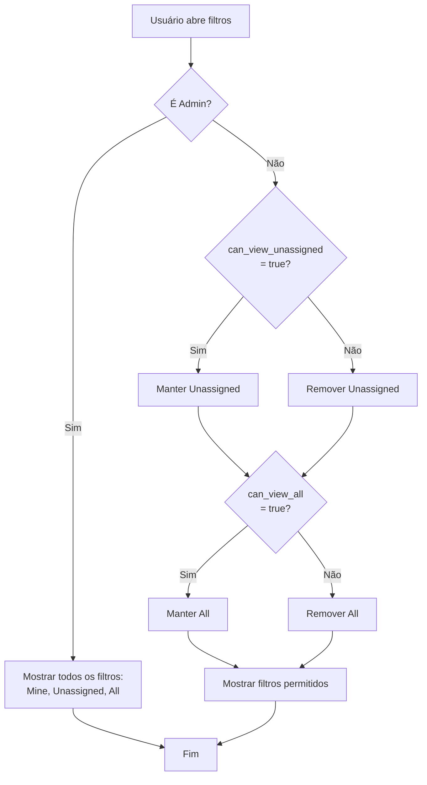

# Permissionamento de Filtros de Conversas

## Visão Geral

Implementação de controle de permissões para filtros de conversas baseado em propriedades do usuário na tabela `account_users`.

## Alterações Realizadas

### 1. Tipo Account (`src/types/Account.ts`)

Adicionadas duas novas propriedades opcionais ao tipo `Account`:

```typescript
export interface Account {
  // ... propriedades existentes
  can_view_unassigned_conversations?: boolean;
  can_view_all_conversations?: boolean;
}
```

### 2. Componente AssigneeTypeFilters (`src/screens/conversations/components/conversation-filters/AssigneeTypeFilters.tsx`)

Implementada lógica de permissionamento para controlar quais opções de filtro de assignee type são exibidas.

## Regras de Permissionamento

### Administradores
- **Podem ver todos os filtros**: "Mine", "Unassigned" e "All"
- Identificação: usuário com role `administrator` ou com permissão `administrator`

### Usuários Não-Administradores
As permissões são controladas pelas seguintes propriedades da conta ativa:

#### `can_view_unassigned_conversations`
- **`true`**: Usuário pode ver e selecionar o filtro "Unassigned"
- **`false`**: Filtro "Unassigned" não é exibido na lista de opções
- **`undefined/null`**: Default para `true` (retrocompatibilidade)

#### `can_view_all_conversations`
- **`true`**: Usuário pode ver e selecionar o filtro "All"
- **`false`**: Filtro "All" não é exibido na lista de opções
- **`undefined/null`**: Default para `true` (retrocompatibilidade)

### Filtro "Mine"
- Sempre visível para todos os usuários
- Não é afetado pelas novas permissões

## Fluxo de Verificação



## Implementação Técnica

### Código Principal

```typescript
export const AssigneeTypeFilters = () => {
  const user = useSelector(selectUser);
  const { account_id: activeAccountId } = user || { account_id: null };

  const userPermissions = user ? getUserPermissions(user, activeAccountId) : [];
  const currentAccount = user ? getCurrentAccount(user, activeAccountId) : undefined;

  // Check if user is administrator
  const isAdmin =
    userPermissions.includes('administrator') ||
    currentAccount?.role === 'administrator';

  let assigneeTypes = assigneeTypeList;

  if (isAdmin) {
    // Administrators can see all assignee types
    assigneeTypes = assigneeTypeList;
  } else {
    // For non-admin users, check the new permission flags
    const canViewAll = currentAccount?.can_view_all_conversations ?? true;
    const canViewUnassigned = currentAccount?.can_view_unassigned_conversations ?? true;

    // Filter based on the new permission flags
    assigneeTypes = assigneeTypeList.filter(type => {
      if (type === 'all' && !canViewAll) {
        return false;
      }
      if (type === 'unassigned' && !canViewUnassigned) {
        return false;
      }
      return true;
    });
  }

  return (
    // ... renderização dos filtros
  );
};
```

## Exemplos de Uso

### Exemplo 1: Usuário Admin
```json
{
  "role": "administrator",
  "can_view_unassigned_conversations": false,
  "can_view_all_conversations": false
}
```
**Resultado**: Vê todos os filtros (Mine, Unassigned, All)

### Exemplo 2: Usuário Normal com Todas as Permissões
```json
{
  "role": "agent",
  "can_view_unassigned_conversations": true,
  "can_view_all_conversations": true
}
```
**Resultado**: Vê todos os filtros (Mine, Unassigned, All)

### Exemplo 3: Usuário Normal Sem Permissão para "Unassigned"
```json
{
  "role": "agent",
  "can_view_unassigned_conversations": false,
  "can_view_all_conversations": true
}
```
**Resultado**: Vê apenas (Mine, All)

### Exemplo 4: Usuário Normal Sem Permissão para "All"
```json
{
  "role": "agent",
  "can_view_unassigned_conversations": true,
  "can_view_all_conversations": false
}
```
**Resultado**: Vê apenas (Mine, Unassigned)

### Exemplo 5: Usuário Normal Sem Nenhuma Permissão Extra
```json
{
  "role": "agent",
  "can_view_unassigned_conversations": false,
  "can_view_all_conversations": false
}
```
**Resultado**: Vê apenas (Mine)

### Exemplo 6: Retrocompatibilidade (campos não definidos)
```json
{
  "role": "agent"
}
```
**Resultado**: Vê todos os filtros (Mine, Unassigned, All) - comportamento padrão

## Backend Requirements

Para que esta implementação funcione corretamente, o backend precisa:

1. **Incluir os campos na resposta da API de login/perfil**:
   ```json
   {
     "accounts": [
       {
         "id": 1,
         "role": "agent",
         "can_view_unassigned_conversations": true,
         "can_view_all_conversations": false,
         // ... outros campos
       }
     ]
   }
   ```

2. **Persistir os valores na tabela `account_users`**:
   ```sql
   ALTER TABLE account_users 
   ADD COLUMN can_view_unassigned_conversations BOOLEAN DEFAULT TRUE,
   ADD COLUMN can_view_all_conversations BOOLEAN DEFAULT TRUE;
   ```

## Testes Recomendados

1. ✅ Testar com usuário administrador
2. ✅ Testar com usuário normal com ambas permissões habilitadas
3. ✅ Testar com usuário normal com apenas `can_view_unassigned_conversations` habilitada
4. ✅ Testar com usuário normal com apenas `can_view_all_conversations` habilitada
5. ✅ Testar com usuário normal sem nenhuma permissão
6. ✅ Testar retrocompatibilidade com contas antigas (sem os campos definidos)
7. ✅ Verificar comportamento ao trocar de conta

## Arquivos Modificados

- `src/types/Account.ts` - Adicionados novos campos de permissão
- `src/screens/conversations/components/conversation-filters/AssigneeTypeFilters.tsx` - Implementada lógica de permissionamento

## Notas de Implementação

- **Retrocompatibilidade**: Campos undefined/null defaultam para `true` para manter compatibilidade com contas existentes
- **Prioridade Admin**: Administradores sempre têm acesso total, independente dos valores dos campos de permissão
- **Filtro "Mine"**: Sempre visível e não pode ser desabilitado
- **Type Safety**: Uso de optional chaining (`?.`) para evitar erros com contas sem os novos campos

## Data: 31/10/2025

